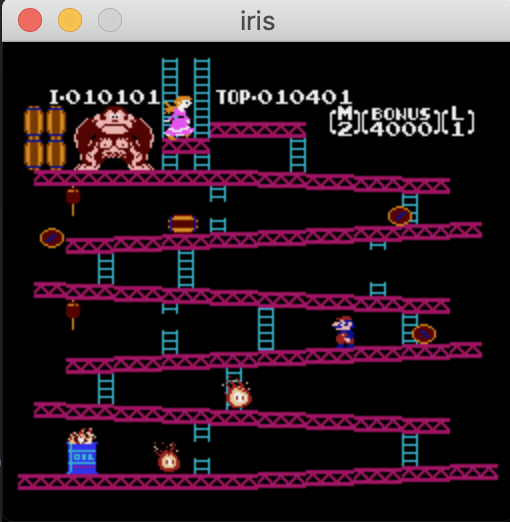
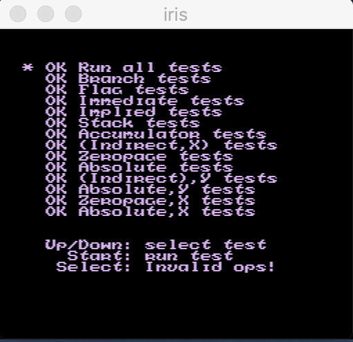
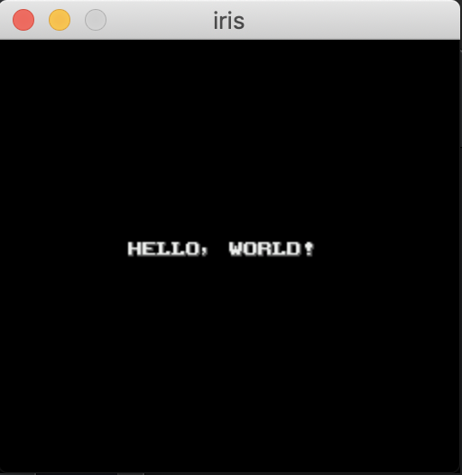

# IRIS
**This repository is WIP.**  

NES emulator written with Scala.

* Only Mapper 0 & no scroll games are available.
* No sound.
* FPS is unstable.
* Controller 2 isn't implemented.





## Usage

```
sbt "run path/to/rom-file"
```

If you want to display "HELLO, WORLD!", use `sample1.nes`.

```
sbt "run ./sample/sample1.nes"
```

## Controller

* W ... up
* A ... left
* S ... down
* D ... right
* K ... A
* J ... B
* Control ... Select
* Enter ... Start
